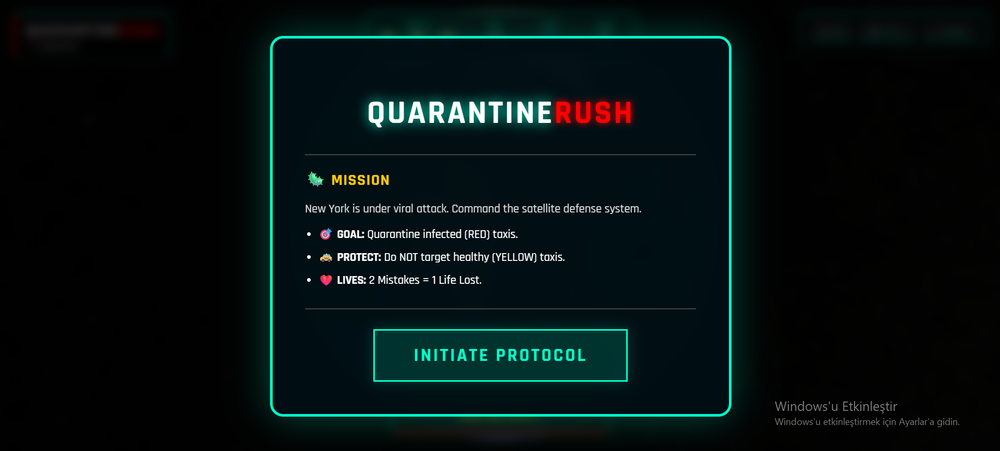
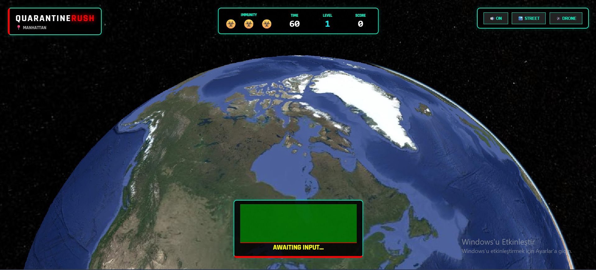
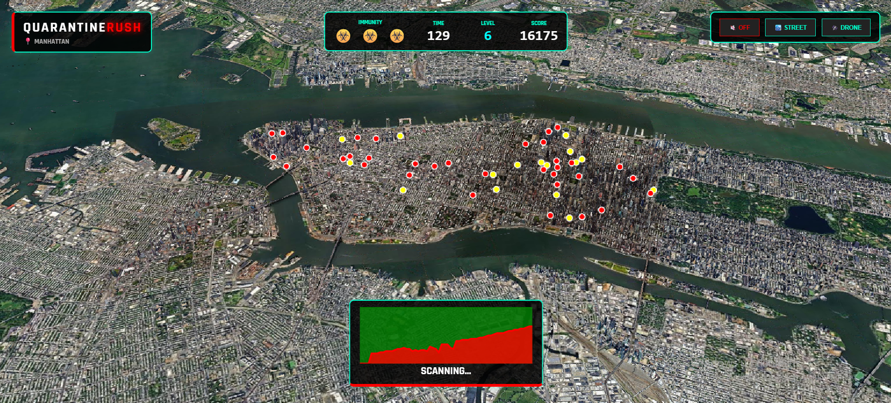

# ☣️ QuarantineRush: GMT458 Advanced GeoGame Project

**Course:** GMT458 - Web GIS  
**Author:** Aybüke Küçük 

### 🎮 Live Demo (Play Now)
[**Click Here to Play QuarantineRush on GitHub Pages**](https://gmt-458-web-gis.github.io/geogame-aaybukekucuk/)

---

## 1. Project Overview & Concept

**QuarantineRush** is a high-stakes, 3D interactive **GeoGame** developed as a capstone project for the GMT458 Web GIS course.

Unlike traditional 2D map games, this project utilizes **CesiumJS** to render a **photorealistic 3D model of New York City**. The player assumes the role of a **Crisis Operations Manager** during a zombie virus outbreak spreading through the city's taxi network.

**The Goal:** Utilize real-time geospatial analysis tools to identify infected agents (Red Taxis), distinguish them from civilians (Yellow Taxis), and deploy quarantine buffers to contain the outbreak before the infection rate becomes critical.

---

## 2. Game Mechanics

This section addresses the specific design requirements outlined in the assignment description.

### ▪️ How does the game progress? (Difficulty & Progression)
The game features a **Dynamic Difficulty System** based on the player's score:

1.  **Temporal Component:** The game is a race against time starting with **60 seconds**.
2.  **Leveling System:**
    * **Level 1:** Standard speed, low infection rate.
    * **Level 2+:** Taxis move faster, infection spreads more aggressively (up to 50% spawn rate).
    * **Visual Progression:** As levels increase, the game time shifts from **Noon -> Sunset -> Night**, activating city lights and neon bloom effects.
3.  **Precision Challenge:** As the player levels up, the **Quarantine Buffer Radius shrinks**, requiring higher spatial precision to catch viruses without hitting civilians.

### ▪️ How many questions/tasks will there be?
This is a **Continuous Simulation Game**, not a static quiz.
* **Tasks:** The "tasks" are dynamically spawning infected taxis.
* **Count:** Unlimited. The game generates procedural taxi routes endlessly until the player loses all lives or time runs out.

### ▪️ How many lives does the user have?
The player starts with **3 Immunity Lives (☣️)**. A sophisticated penalty system is in place:
* **Mistake Penalty:** Clicking on empty space or quarantining *only* healthy taxis adds to a "Mistake Counter." **2 Mistakes = 1 Life Lost.**
* **Infection Overload:** If the total number of infected taxis exceeds a critical threshold (40+), the city's defense fails, and a life is lost.

---

## 3. Technical Stack

This project integrates multiple **Advanced Geovisualisation and Data Analysis** packages, exceeding the basic requirements to achieve bonus points.

### 1. CesiumJS (3D Engine & Visualization)
* **Why:** Replaces standard 2D maps (Leaflet/OpenLayers) with a **Photorealistic 3D Globe**.
* **Implementation:**
    * Renders Google's 3D Tiles of NYC buildings.
    * Manages 3D Entities (Box geometries for taxis, Cylinders for quarantine zones).
    * **Post-Processing:** Uses **Bloom (Glow) Effects** to create a neon/cyberpunk atmosphere for infected units.

### 2. Turf.js (Geospatial Analysis)
* **Why:** Provides client-side spatial analysis capabilities.
* **Implementation:**
    * **`turf.distance()`**: Calculates the real-world distance between the user's click coordinate and moving taxi agents in kilometers.
    * **Buffer Logic:** Determines if a point (taxi) falls within a specific radius (quarantine zone) instantly.

### 3. Chart.js (Data Visualization)
* **Why:** Visualizes temporal game data.
* **Implementation:**
    * A live-updating **Stacked Area Chart** on the HUD.
    * Tracks the **Healthy vs. Infected** population in real-time, providing visual feedback on the outbreak status.

### 4. AudioContext API (Immersive Audio)
* **Why:** Enhances user experience.
* **Implementation:** Custom sound engine handling background music, success chimes (Combo), and alarm sirens (Game Over) dynamically.

---

## 4. Data Source (NYC Taxi Data)
In compliance with the assignment ("Explore NYC taxi data"), this project simulates taxi patterns based on **real-world NYC hotspots**.
* The `sim_data.js` file contains coordinates for key locations (Times Square, Wall Street, Penn Station, etc.).
* Taxi agents are procedurally generated to travel between these authentic hubs, mimicking real traffic density.

---

## 5. Frontend Layout & Visuals

The user interface is designed as a futuristic **HUD (Heads-Up Display)**:

* **Top Panel:** Displays Lives, Time, Current Level, and Score.
* **Bottom Panel:** Houses the Chart.js analytics graph and status alerts (e.g., "🔥 COMBO x3").
* **Theme:** Features a glassmorphism effect with neon accents suitable for a bio-hazard theme.

### Gameplay Demo (GIF)
*(Shows the 3D environment, 'Combo' mechanics, and UI interactions)*

### Layout Screenshot

---

## 6. Project Directory Structure

QuarantineRush/
├── index.html          # Main entry point (UI & Game Container)
├── README.md           # Project documentation
├── src/
│   ├── css/
│   │   └── style.css   # Game styling, HUD, and animations
│   └── js/
│       ├── map.js      # Core game logic, CesiumJS setup, interactions
│       └── sim_data.js # Taxi simulation data and coordinate generation
└── assets/
    ├── screenshot.png      # Layout sketch image
    ├── quarantinerush.gif  # Gameplay demo GIF
    └── sound/              # Audio assets
        ├── start.mp3
        ├── alert.mp3
        ├── gameover.mp3
        └── soundtrack.mp3