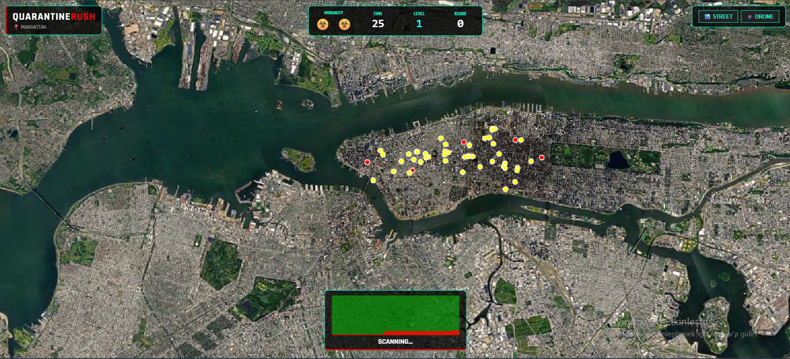

# ☣️ QuarantineRush: GMT458 - GeoGame Project

**Course:** GMT458 - Web GIS  
**Author:** Aybüke Küçük

---

## 1. Project Aim & Concept

**QuarantineRush** is a high-stakes 3D interactive GeoGame developed to meet the requirements of the GMT458 assignment.

The game is built on a photorealistic 3D model of New York City. The player acts as a crisis manager, tasked with identifying and containing a spreading "Zombie Virus" carried by taxi units. The goal is to achieve the highest score possible by curing taxis, surviving for 60 seconds, and managing limited lives and resources.

## 2. Design of the GeoGame (Answers to Assignment Questions)

This section directly answers the questions specified in the assignment objectives.

### ▪️ How the game will progress? (Difficulty & Progression)

The game's progression is based on a dynamic **Level and Score System**:

1.  **Time-Based:** The core game loop is a **60-second** sprint. The player's score determines their progression.
2.  **Levels (Difficulty):** The game is a "complete as many tasks as possible" challenge.
    * **Level 1 Target:** 1000 Points.
    * **Level 2 Target:** 3000 Points (Requires +2000 more).
    * **Level 3 Target:** 6000 Points (Requires +3000 more).
    * The score required to level up increases progressively.
3.  **Difficulty Scaling:** As the player levels up:
    * Infected taxis spawn **more frequently**.
    * All taxis (especially infected ones) move **faster**.
    * The player's quarantine buffer **shrinks**, requiring higher precision.
    * The player receives a small **time bonus** as a reward.

### ▪️ How many questions will there be?
This is a real-time strategy game, not a quiz. There are no "questions." The **tasks are the dynamically spawning infected taxis**. The number of tasks is unlimited; the challenge is to cure as many as possible within the time and life limits.

### ▪️ How many lives, if any, does a user have?
Yes, the player has **3 Immunity Lives (☣️)**. A life is lost in two ways:

1.  **Mistake Penalty:** If the player clicks incorrectly 2 times (hitting an empty area OR a healthy-only zone), they lose 1 life.
2.  **Infection Overload:** If the total number of infected taxis on the map exceeds a critical threshold, they are penalized 1 life.

---

## 3. Technology Stack & Bonus Point Justification

This project explores advanced JavaScript libraries beyond Leaflet/OpenLayers to meet the **bonus** criteria:

* ### 1. CesiumJS (Advanced Geovisualisation - BONUS)
    This is the **core 3D engine** of the game. It renders Google's **Photorealistic 3D Tiles** of NYC and manages all 3D game objects (taxis as `Box` entities, quarantine zones as `Cylinder` entities).

* ### 2. Turf.js (Data Analysis Package - BONUS)
    This is the "Geo" brain of the game. When the player clicks, **`Turf.js`** performs a real-time **geospatial analysis** (`turf.distance()`) to calculate which taxis are inside the quarantine buffer (a core "Point-in-Polygon" operation).

* ### 3. Chart.js (Data Analysis Package - BONUS)
    The HUD features a live-updating **Stacked Area Chart**. This chart visualizes the real-time ratio of Healthy vs. Infected taxis, providing critical statistical feedback.

---

## 4. Data Source (NYC Taxi Data)
The assignment requirement to `Explore NYC taxi data` is met by simulating taxi movement patterns based on real-world NYC hotspots (Times Square, Wall Street, Central Park, etc.).

---

## 5. Frontend Layout & Sketch

The layout is a futuristic "Heads-Up Display (HUD)" designed for instant readability.

* **Top Panel:** Displays critical stats (Lives ☣️, Time, Level, Score).
* **Bottom Panel:** Shows the `Chart.js` live infection graph and status messages (e.g., "🔥 COMBO!", "💔 LIFE LOST!").
* **Camera Controls:** Allows switching between "Drone View" and "Street View".

### Screenshot (Layout Sketch)
*(This screenshot fulfills the "drawings or sketches" requirement)*

---

## 6. Gameplay Promo Video

(Aşağıdaki video, GitHub'a yüklenmiştir ve doğrudan README içinde oynatılabilir.)

---

## 7. Project Management (Git Usage)
Regular commits were made to the repository to track design and implementation phases, fulfilling the "Regular use of Git" requirement.